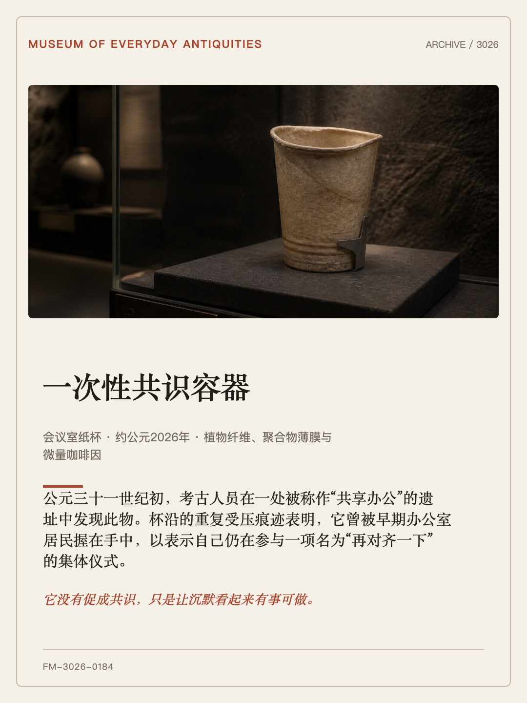
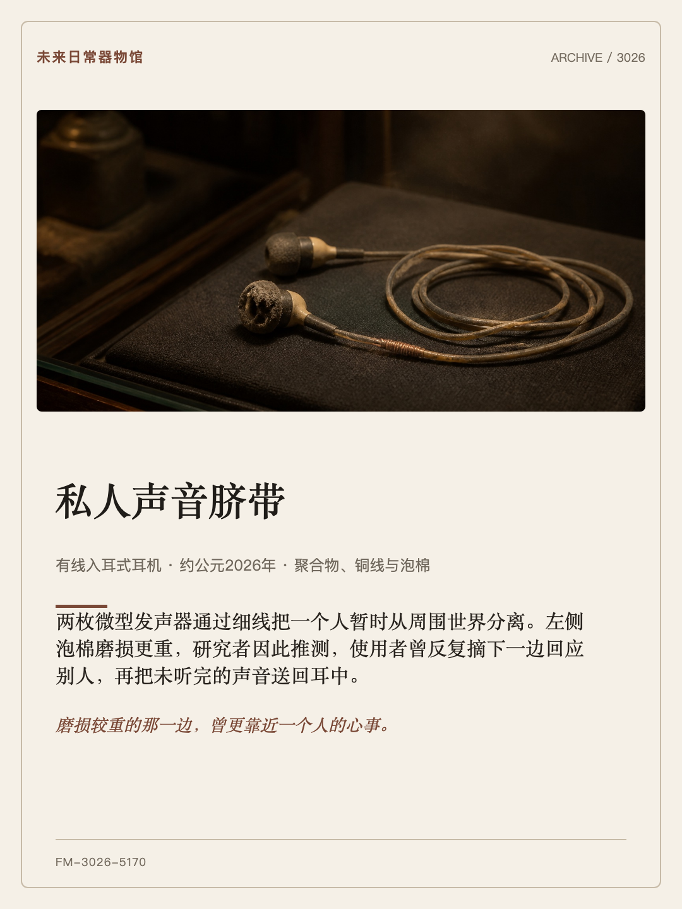
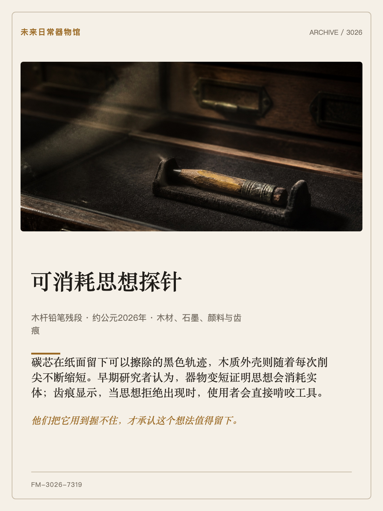

# 3026号藏品（Artifact 3026）

> **3026 年会把它认成什么？**

简体中文 · [English](README.en.md)

Artifact 3026 是一个面向**支持开放 Agent Skills 标准的 AI 助手**的开源 Skill。它把日常物品的照片或描述变成一件来自未来的虚构博物馆藏品：宿主 Agent 负责策展文案和可选的图像创作，零依赖本地脚本负责稳定生成 1080×1440 分享卡。

仓库 URL 继续保持为 <https://github.com/xxwzkdwz/future-museum-curator>；展示品牌与 Skill 标识分别升级为 **Artifact 3026 / 3026号藏品** 与 `artifact-3026`。命名调研与反证见 [docs/NAMING.md](docs/NAMING.md)。

<p align="center">
  
</p>

## 六件藏品，一眼看完

六个示例直接展示在首页，覆盖中文/英文与 `deadpan`、`tender`、`absurd` 三种口吻。点击缩略图可查看可编辑 SVG；每例同时保留 [JSON 数据](examples/)、[生成场景](examples/scenes/)与 [1080×1440 PNG](examples/cards/)，图像来源见 [examples/SOURCES.md](examples/SOURCES.md)。

<table>
  <tr>
    <td width="50%" align="center"><a href="examples/meeting-room-paper-cup.svg"></a><br><strong>一次性共识容器</strong><br><sub>中文 · deadpan</sub></td>
    <td width="50%" align="center"><a href="examples/tangled-charging-cable.svg"></a><br><strong>Portable Energy Umbilical</strong><br><sub>English · deadpan</sub></td>
  </tr>
  <tr>
    <td align="center"><a href="examples/forgotten-folding-umbrella.svg"></a><br><strong>Rain Negotiation Device</strong><br><sub>English · absurd</sub></td>
    <td align="center"><a href="examples/worn-wired-earbuds.svg"></a><br><strong>私人声音脐带</strong><br><sub>中文 · tender</sub></td>
  </tr>
  <tr>
    <td align="center"><a href="examples/faded-brass-key.svg"></a><br><strong>Permission to Return</strong><br><sub>English · tender</sub></td>
    <td align="center"><a href="examples/used-pencil-stub.svg"></a><br><strong>可消耗思想探针</strong><br><sub>中文 · absurd</sub></td>
  </tr>
</table>

## 它为什么值得反复玩

给未来一件普通物品，看看它会误解成什么。打结充电线变成“便携能源脐带”，旧钥匙变成“回家的许可”。每次换一件书桌、背包、厨房或家庭旧物，都会暴露一个不同的当代习惯；统一的馆藏编号、策展口吻与卡片系统又让它天然适合连载，而不只是一次性滤镜。

默认视觉把物品处理成“考古幸存物”：主体仍可识别，但允许符合材质的褪色、磨损与修复痕迹。要求 `original-condition preservation` 可仅替换环境和光线，不添加未来损伤。

## 兼容性

本仓库只有一个权威 Skill：`.agents/skills/artifact-3026/SKILL.md`。平台包装只负责把这个目录复制或链接到官方识别的位置，不维护第二份 `SKILL.md`。

| 平台 | 官方开放标准支持 | 本仓库中的使用方式 |
|---|---|---|
| OpenAI / Codex | 原生读取项目或用户级 `.agents/skills/` | 克隆后项目内可发现；用户级可运行安装脚本 |
| Cursor | 原生读取 `.agents/skills/`，也兼容若干平台目录 | 克隆后项目内可发现；用户级可运行安装脚本 |
| GitHub Copilot | Agent、代码审查、CLI、VS Code 等支持 `.agents/skills/` | 克隆后使用标准目录；也可按官方 `gh skill` 预览流程安装 |
| Claude / Claude Code | 支持开放 Agent Skills，但原生目录是 `.claude/skills/` | 使用安装脚本复制或链接同一个权威目录 |

以上是官方文档所述的兼容路径，不等同于“所有 AI 都能一键安装”。官方来源、版本边界与本地实测状态见 [COMPATIBILITY.md](COMPATIBILITY.md)。

## 安装

克隆仓库后，支持项目级 `.agents/skills/` 的宿主可直接读取权威目录：

```bash
git clone https://github.com/xxwzkdwz/future-museum-curator.git
cd future-museum-curator
```

复制到支持开放 `.agents` 约定的用户目录（Codex、Cursor、GitHub Copilot）：

```bash
python3 scripts/install_skill.py --platform agents --scope user --mode copy
```

适配 Claude / Claude Code 的用户目录：

```bash
python3 scripts/install_skill.py --platform claude --scope user --mode copy
```

开发时可把 `--mode copy` 改为 `--mode symlink`。脚本若发现目标已存在会停止，不会覆盖现有 Skill；先用 `--dry-run` 可只查看目标路径。

对于没有自动 Skill 加载器的普通聊天产品，可生成便携包并手动附加 ZIP，或直接附加 `SKILL.md` 与其 `references/`、`scripts/` 资源：

```bash
python3 scripts/package_skill.py
```

这种方式属于**手动兼容**，能否读取附件和执行本地脚本取决于具体产品，不能宣传为一键安装。

## 使用

附上一张照片或描述一件物品，然后要求宿主 Agent 使用 `artifact-3026`：

```text
使用 artifact-3026：3026 年会把这根打结充电线认成什么？请生成竖版分享卡。
```

可补充：

- `语气冷静严肃，不要堆笑话。`
- `温柔一点，不要搞笑。`
- `保留每一道划痕，只替换背景。`
- `原物完好保存，不要添加未来损伤。`
- `给我三个策展人注释版本。`

项目页面与 [examples/SOURCES.md](examples/SOURCES.md) 会客观说明 AI 辅助流程和图像来源；成品卡画面不嵌入 AI 生成标识。所有解释仍属于创意虚构，不声称真实来源、鉴定、估值或历史真实性。项目不托管推理服务，不要求共享 API Key、账号、统计或上传接口。

## 直接渲染与校验

```bash
python3 .agents/skills/artifact-3026/scripts/render_exhibit_card.py \
  examples/meeting-room-paper-cup.json \
  --output examples/meeting-room-paper-cup.svg

python3 -m unittest discover -s tests -v
python3 scripts/validate_release.py
skills-ref validate .agents/skills/artifact-3026
```

最后一条需要本地已安装官方参考校验器；未安装时，前两项仍会验证目录、元数据、单一 `SKILL.md`、平台中立用语、示例一致性和渲染器行为。

## 仓库结构

- `.agents/skills/artifact-3026/`：唯一权威 Skill、引用资料与零依赖渲染器
- `examples/`：双语示例、场景、SVG 与 PNG 画廊
- `scripts/install_skill.py`：复制/软链接安装适配器
- `scripts/package_skill.py`：普通聊天产品的手动 ZIP 交付
- `scripts/validate_release.py` 与 `tests/`：兼容性、结构与行为验证

## 隐私与边界

- 使用照片前检查人脸、地址、工牌、账号信息等可识别内容；
- 不添加没有依据的品牌标志，不暗示真实博物馆完成鉴定；
- 日期、馆藏编号、机构与解释全部属于虚构；
- 示例和生成卡不得包含雇主机密、专有材料或客户内容。

## 许可证与作者

MIT © 2026 [WANG ZHEN](https://github.com/xxwzkdwz)
