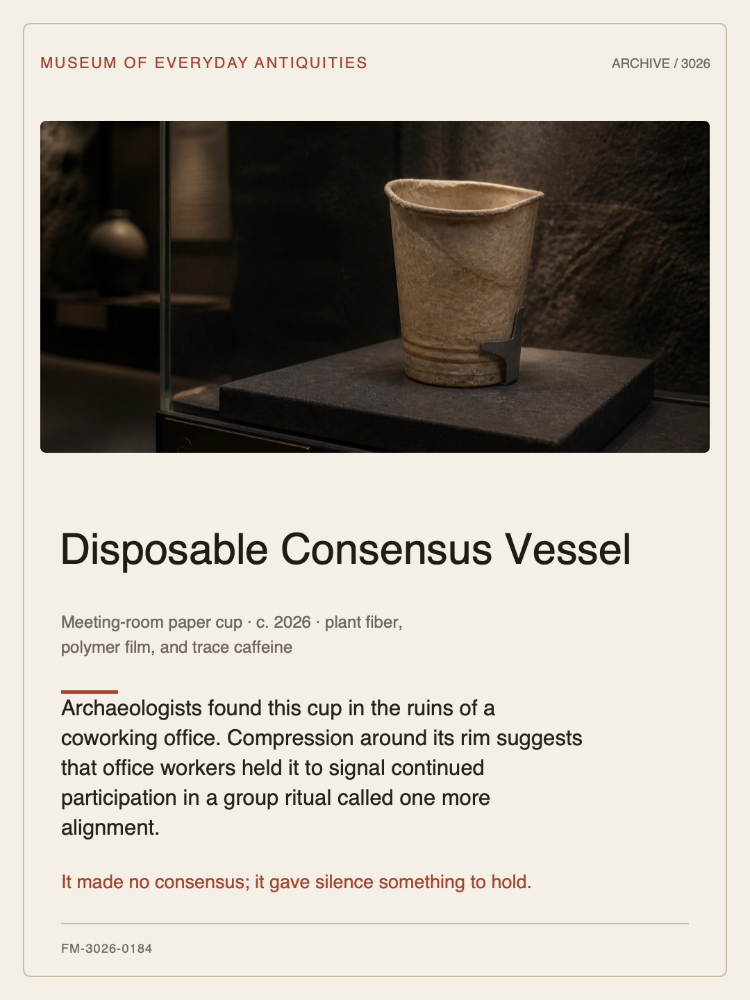
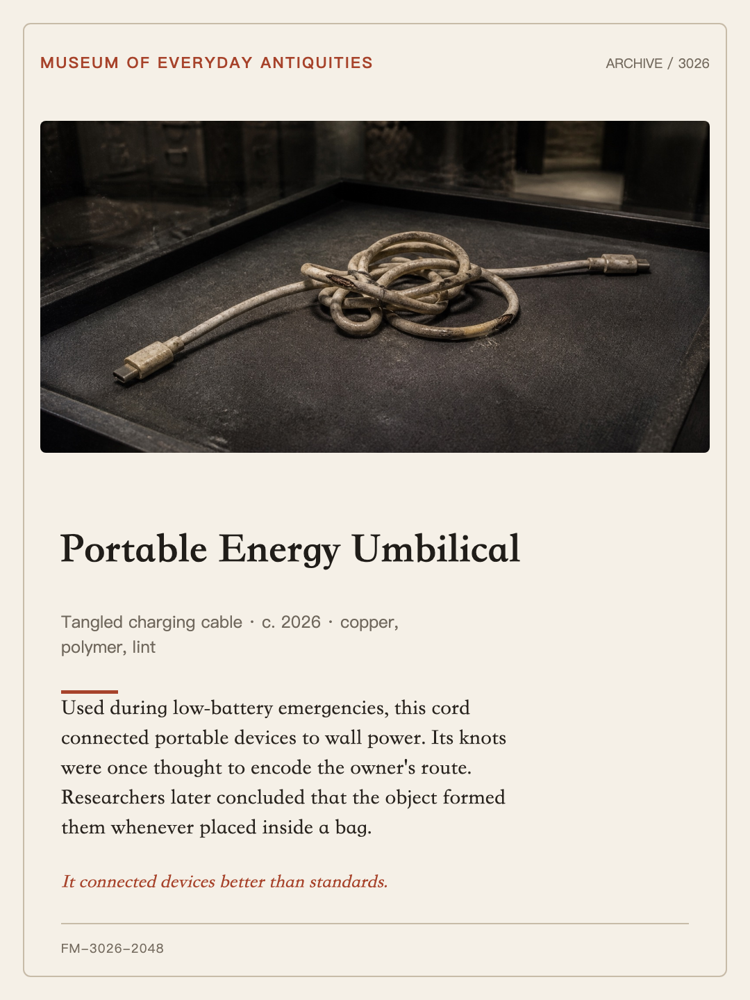
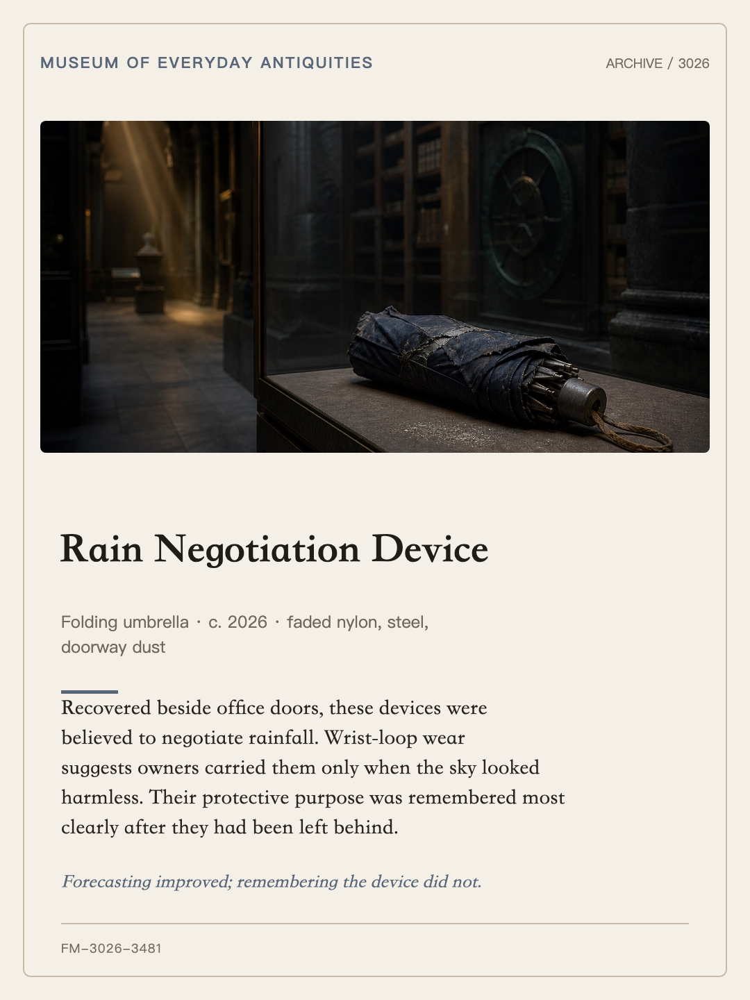
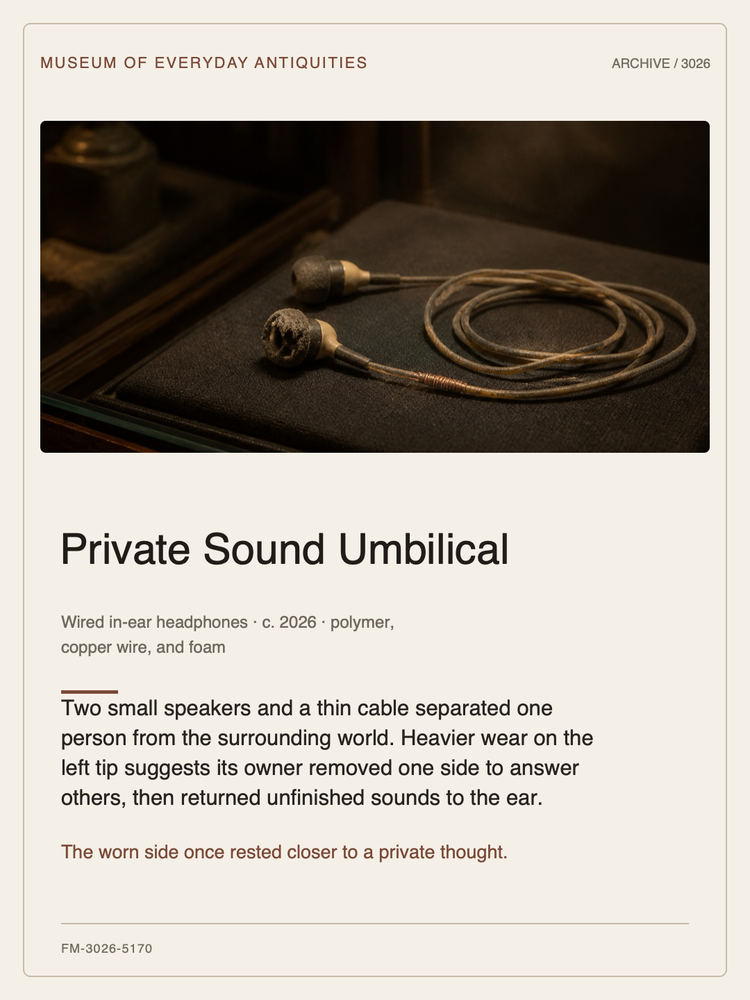
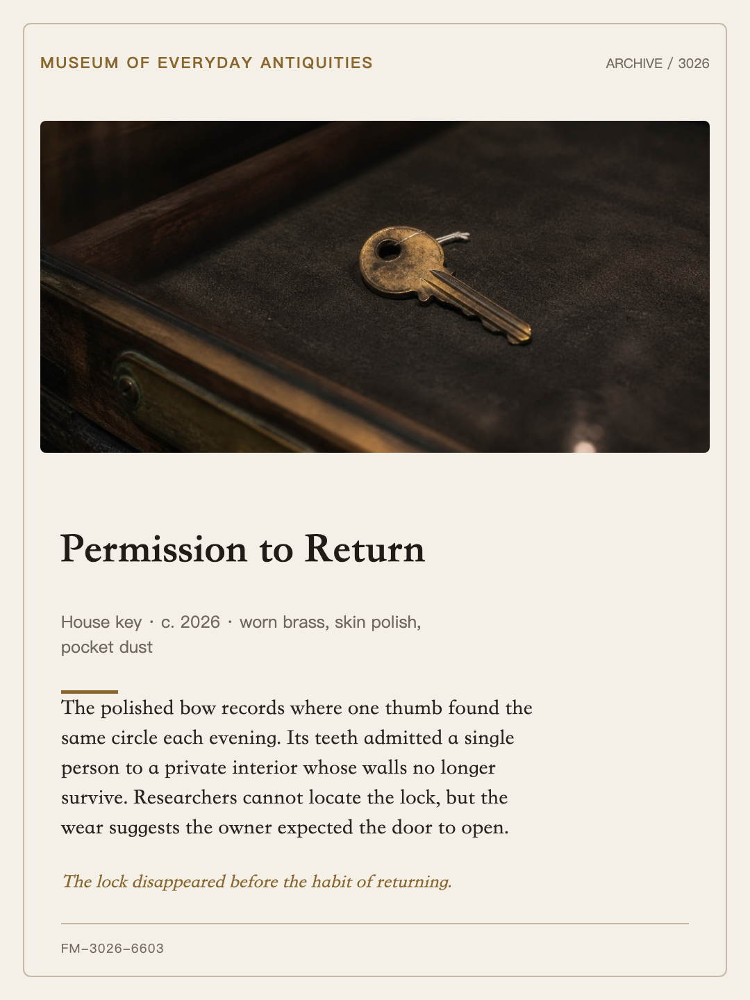
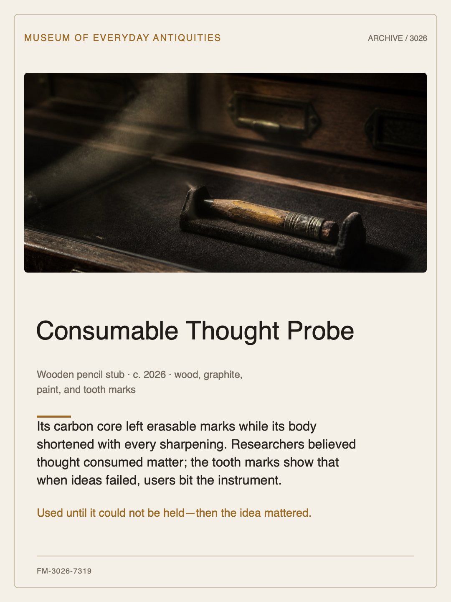

# Artifact 3026

> **What will 3026 think this was?**

English · [简体中文](README.zh-CN.md)

[](https://skills.sh/xxwzkdwz/artifact-3026)
[](LICENSE)

Turn a photo of an everyday object into a fictional museum exhibit from the year 3026—complete with a future-archaeology scene, a deadpan label, an accession number, and a shareable 1080×1440 card.

Artifact 3026 is an open-source skill **for AI assistants that support the open Agent Skills standard**. Your assistant does the creative work with its available tools; the repository provides the curatorial workflow and a dependency-free card renderer. No hosted service, shared API key, account, analytics, or upload endpoint is required.

<p align="center">
  
</p>

## Install

```bash
npx skills add https://github.com/xxwzkdwz/artifact-3026 --skill artifact-3026
```

The installer finds supported agents and lets you choose where to add the skill. Then attach a photo and ask:

```text
Use artifact-3026: What will 3026 think this was? Render a vertical share card.
```

<details>
<summary><strong>Manual installation and local development</strong></summary>

Clone the repository first:

```bash
git clone https://github.com/xxwzkdwz/artifact-3026.git
cd artifact-3026
```

Install the canonical skill in a platform-specific user directory:

```bash
# Codex, Cursor, and GitHub Copilot
python3 scripts/install_skill.py --platform agents --scope user --mode copy

# Claude / Claude Code
python3 scripts/install_skill.py --platform claude --scope user --mode copy

# Qwen Code
python3 scripts/install_skill.py --platform qwen --scope user --mode copy

# Kimi Code CLI
python3 scripts/install_skill.py --platform kimi --scope user --mode copy
```

Use `--mode symlink` while developing, or add `--dry-run` to inspect the destination. The installer stops when a different target already exists and never silently overwrites it.

To make a portable ZIP for Volcengine AgentKit or manual attachment in a chat product:

```bash
python3 scripts/package_skill.py
```

</details>

## What it creates

Each run can produce:

- a recognizable museum display image that preserves the original object;
- a title, original purpose, future misinterpretation, curator note, and accession number;
- an editable SVG and a vertical PNG card ready for sharing.

You can steer the tone—deadpan, tender, absurd, or restrained—and ask the assistant to preserve scratches, wear, or the object's original condition.

## See the present through the eyes of 3026

Six ordinary objects, reimagined as artifacts from the future. Click a card for its editable SVG. Each example also includes [JSON data](examples/), a generated [museum scene](examples/scenes/), and a [1080×1440 PNG](examples/cards/). Image provenance is recorded in [examples/SOURCES.md](examples/SOURCES.md).

<table>
  <tr>
    <td width="50%" align="center"><a href="examples/english/meeting-room-paper-cup.svg"></a><br><strong>Disposable Consensus Vessel</strong><br><sub>English · deadpan</sub></td>
    <td width="50%" align="center"><a href="examples/tangled-charging-cable.svg"></a><br><strong>Portable Energy Umbilical</strong><br><sub>English · deadpan</sub></td>
  </tr>
  <tr>
    <td align="center"><a href="examples/forgotten-folding-umbrella.svg"></a><br><strong>Rain Negotiation Device</strong><br><sub>English · absurd</sub></td>
    <td align="center"><a href="examples/english/worn-wired-earbuds.svg"></a><br><strong>Private Sound Umbilical</strong><br><sub>English · tender</sub></td>
  </tr>
  <tr>
    <td align="center"><a href="examples/faded-brass-key.svg"></a><br><strong>Permission to Return</strong><br><sub>English · tender</sub></td>
    <td align="center"><a href="examples/english/used-pencil-stub.svg"></a><br><strong>Consumable Thought Probe</strong><br><sub>English · absurd</sub></td>
  </tr>
</table>

## Make it a shared ritual

- **Post a daily artifact:** Photograph one small object each day and build your own future museum over time.
- **Make a reveal video:** Show the real object first, cut to the exhibit card, and read the museum label aloud. Let the comments choose what enters the museum next.
- **Play with friends:** Swap object photos, guess how the future will misunderstand them, and reveal the generated cards.
- **Build a personal exhibition:** Turn keys, earbuds, tickets, and desk objects into a birthday keepsake, travel archive, or year-in-review collection.

Share with **#Artifact3026**, link back to this repository, or post in [GitHub Discussions](https://github.com/xxwzkdwz/artifact-3026/discussions). Community artifacts may join a future showcase with the creator's permission.

## Works with your AI

Artifact 3026 is vendor-neutral. Installation depends on the host, not just the model:

| Experience | Examples | Use |
|---|---|---|
| Open Agent Skills hosts | Codex, Cursor, GitHub Copilot | Install with the command above or read `.agents/skills/artifact-3026/` in place |
| Compatible skill hosts | Claude / Claude Code, Qwen Code, Kimi Code CLI | Use the command above when detected, or open the manual setup section |
| Custom-skill platforms | Volcengine AgentKit | Build the portable ZIP and upload it as a custom skill |
| Ordinary chat products | Doubao, Zhipu Qingyan, Qwen chat, Kimi, DeepSeek | Attach `SKILL.md` or the portable ZIP and use the prompt below |

<details>
<summary><strong>Prompt for a chat product without a skill installer</strong></summary>

```text
Read the attached Artifact 3026 skill. Reimagine this object as an exhibit in a museum in the year 3026 while keeping the object recognizable. Create a future-archaeology display image and provide an artifact name, original purpose, future misinterpretation, curator note, and accession number. If you cannot run the repository renderer, return the copy and image directly.
```

</details>

The repository maintains one canonical `SKILL.md`. See [COMPATIBILITY.md](COMPATIBILITY.md) for official sources, support boundaries, and local test status.

## How it works

1. The host agent studies the object's visible details and separates observation from invention.
2. It writes a fictional future interpretation in the requested tone.
3. If image generation is available, it creates a museum scene while keeping the object recognizable.
4. The local renderer turns the structured exhibit data into a consistent SVG or PNG share card.

The finished card does not embed an AI-generation badge. The project page and [examples/SOURCES.md](examples/SOURCES.md) still disclose the AI-assisted workflow and image provenance.

## Contribute

New artifacts, translations, renderer improvements, and compatibility reports are welcome. See [CONTRIBUTING.md](CONTRIBUTING.md).

<details>
<summary><strong>Run the renderer and release checks</strong></summary>

```bash
python3 .agents/skills/artifact-3026/scripts/render_exhibit_card.py \
  examples/meeting-room-paper-cup.json \
  --output examples/meeting-room-paper-cup.svg

python3 -m unittest discover -s tests -v
python3 scripts/validate_release.py
skills-ref validate .agents/skills/artifact-3026
```

The last command requires the Agent Skills reference validator. The repository tests cover its canonical directory, metadata, renderer behavior, gallery consistency, compatibility adapters, and portable ZIP.

</details>

## Creative boundaries

- Treat every date, institution, accession number, and interpretation as fiction—not authentication, provenance, appraisal, or museum affiliation.
- Check source photos for faces, addresses, badges, account details, or other identifiers before using them.
- Do not add unsupported logos or include confidential, proprietary, client, or employer material.

## License

MIT © 2026 [WANG ZHEN](https://github.com/xxwzkdwz)
